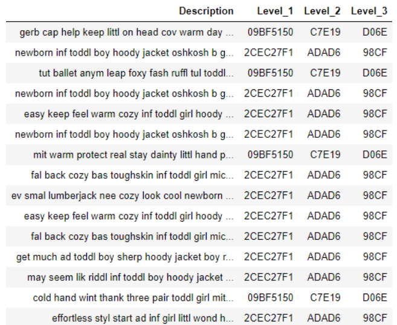

<h1>Product Catergorisation</h1>

The correct categorisation of products is a very important step for online
shops. This step might look straightforward, but it can easily be a nightmare.
This could be due to any number of difficulties, including: 1) the number of
available categories can be huge, 2) the number of available categories can
change constantly, and 3) new products may be added daily.

Manual categorisation of products can be a tedious and labour-intensive task.
Therefore, it makes sense to automate this process. One method is to use
machine learning.

In this task, I will implement a product categoriser based on the following
explanation.

<h2>Approach Description</h2>

As shown in the table below, there are three levels of categories. Level 1 is
the highest and most generic and level 3 is the most specific. The idea is to
create multiple models over a number of iterations.
In the first pass we create one model using the features and the Level 1
column as the class variable.
In the next pass (to predict level 2), we create one separate model for each
unique category in Level 1.
Similarly, for Level 3, the number of models we create is the same as the
number of distinct groups of combinations of the categories in Level 1 and
Level

The total number of models we need to create depends on the number of
categories. For example, if the number of unique categories was 12, 22 and
31 in Levels 1, 2 and 3 respectively, then the total number of models created
will be one model in the first pass, 12 models in the second pass and 264 (12
\* 22) models in the third pass. This makes the total number of models 277 (in
a mock run of a model solution to this task, the number of models was
between 50 and 60).
